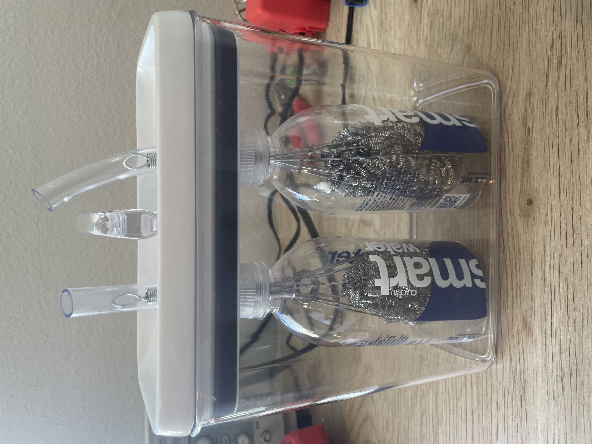

# Electrolysis - RTOS Sensor Monitoring System

A real-time sensor monitoring system built with ESP32 and FreeRTOS for electrolysis reactor data collection and control.

## Project Overview

This project implements a real-time operating system (RTOS) on an ESP32 microcontroller to manage tasks related to electrolysis reactor data collection. It's designed to strengthen skills in C programming, real-time computing, and embedded systems development.

# The Reactor 
My reactor is based on the design presented here [DIY Hydrogen/Oxygen Generators From Grocery Store Items](https://www.youtube.com/watch?v=d85OX6yEwE0&t=457s&pp=ygUUZWxlY3Ryb2x5c2lzIHJlYWN0b3I%3D)

