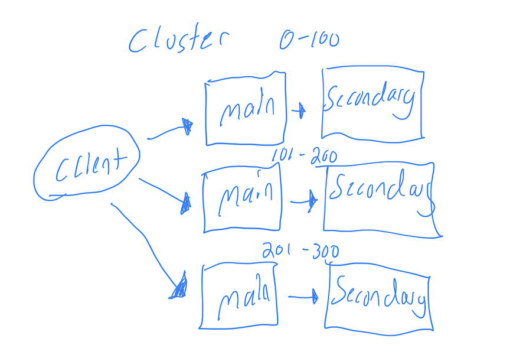
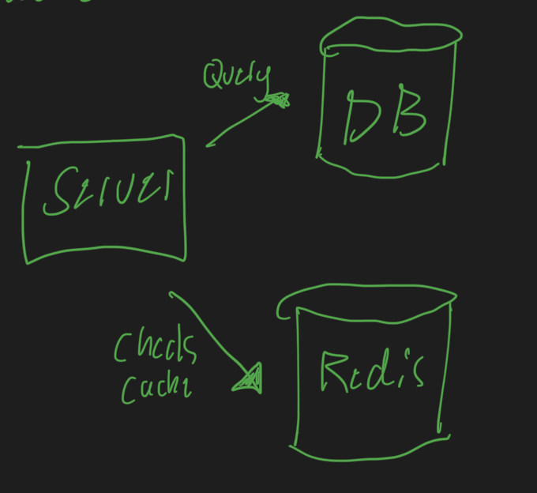
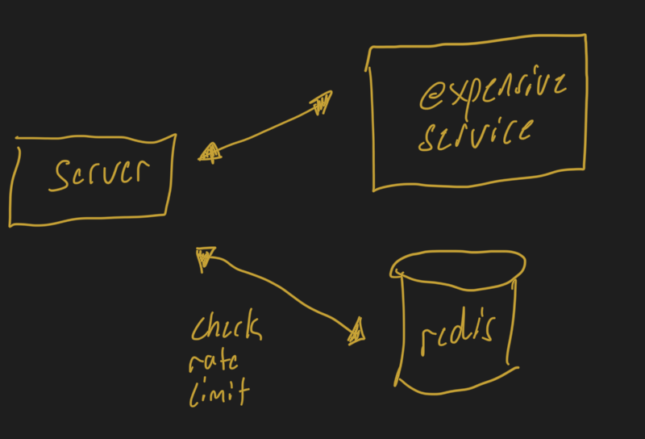
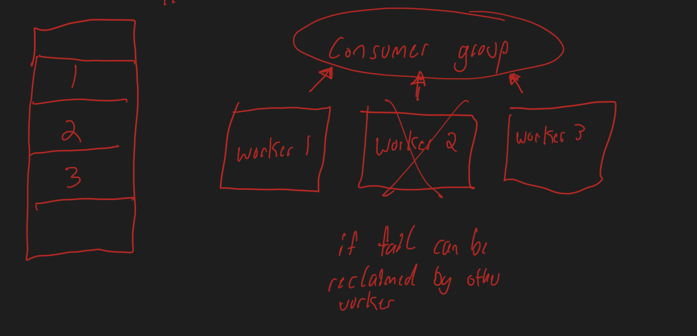
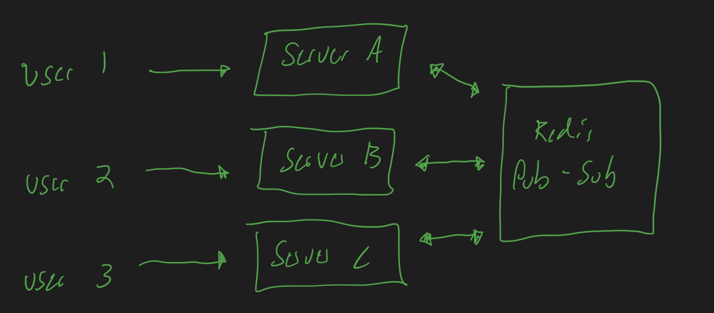

# Tuesday 2-25-2025

## The Art of Writing Efficient Programs

### Chapter 1: Introduction to Performance and Concurrency

- Why performance matters
Single core performance has leveled off since ~2005
Clock rate has stagnated (~1GHz) because power use has stagnated at ~100 Watts
Gains since 2005 have been due to multi core designs and compute/memory 'enhancements'

- Why performance requires the programmer's attention
An efficient program makes good use of the computational hardware
We must use computational resources effectively as programmers or we run the risk of stagnating our programs performance at 2005 levels

- What do we mean by performance
Speed is often used throughput is a related metric (computations/time) as is turnaround time (time/result)
Performance as throughput
Performance as power consumption
Latency tail is another metric (95th percentile time / avg time)
Ultimately what constitutes is heavily dependant on the context of the problem

- How to evaluate the performance
The first law of performance is to never guess about performance
While it's almost impossible to predict the best optimizations in advance, it is possible to identify design decisions that would make subsequent optimizations very hard or even unfeasible 

- Learning about high performance 
Choose the right algorithm
Using CPU resources effectively
Using memory effectively 
Avoiding unnecessary computations
Using concurrency and multi threading effectively
Using the programming language effectively, avoiding inefficiencies  
Measuring performance and interpreting results

## Redis
From video [Redis Deep Dive w/ a Ex-Meta Senior Manager](https://www.youtube.com/watch?v=fmT5nlEkl3U&pp=ygUFcmVkaXM%3D)

Redis is a single threaded in memory data structure server
- First op is executed before the next 
- in memory (fast)
- key value dict 
```bash
set foo 1
get foo -> 1
incr foo -> 2
```

We generally want to use replicas since a single server instance is brittle
main -> secondary
We want to think about key space when scaling
Cluster is another model 



### Use Case 1: Cache
Set the expiration policy
- expire after x seconds
- LRU: after mem runs to limit start to expire least recently accessed items
Hot key issue: Single key is accessed more than others becoming a hot spot/bottleneck
Need to spread out traffic load across entire redis cluster



### Use Case 2: Rate Limiter
Increment key to check rate limit
expire key after x seconds



### Use Case 3: Stream
Distributed append only logs
If a node fails it can be reclaimed by another worker



### Use Case 4: Sorted Set Primitive
Keep a leaderboard of 5 most liked tweets
all sorted set commands start with a z
```bash
zadd tweet 500 abc # Single key
zadd tweet 1 xyz # Single node "tweet"
zremrangebyrank tweets 0 - 5 # remove all but top 5 
```

### Use Case 5: Geospatial Index
```bash
geoadd place 1.234 5.678 station 1
geoadd place 9.876, 5.432 station 2
geosearch place from 1.567 3.765 by radius 5km with dist
```

### Use Case 6: Pub-Sub
Subscribe to topic to get updates
Good for horizontal scaling systems



## Other Resources
[Dist systems MIT course schedule w links](https://pdos.csail.mit.edu/6.824/schedule.html)
