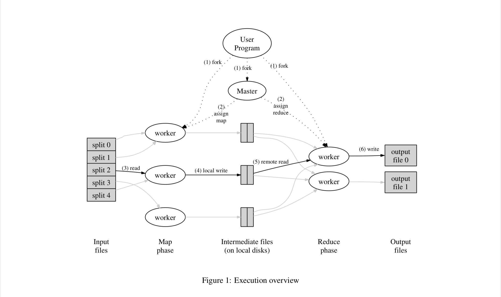

# Thursday 2-27-2025

## Map Reduce
Map reduce is a programming model and an associated implementation for processing and generating large datasets 
Map reduce solves a few problems
- How to parallelize large compute jobs
- Distribute the data over a cluster of commodity machines
- Handle failures in the cluster

**Map**
Apply a function to the input pair
This produces intermediate key-value pairs

All intermediate values are grouped by key and passed to a reduce function

**Reduce**
Accepts an intermediate key *I* and a set of values for that key. I merges these values to form a possibly smaller set of values. Typically just 0 or 1 output value

```c++
map (k1, v1)            -> list(k2, v2)
reduce (k2, list(v2))   -> list(v2)
```



### Implementation
Machines are typically dual-processor x86 running linux with 2-4GB of memory
Commodity networking hard ware is used 100 Mb/s or 1 Gb/s at the machine level but averaging considerably less in overall bisection bandwidth
A cluster consists of hundreds or thousands of machines therefore failures are common
Storage is provided by inexpensive IDE disks attached directly to individual machines GFS is used to manage the data on these disks
Users submit jobs to a scheduling system. Each job consists of a set of tasks and is mapped by the scheduler to available machines

#### Execution
- Split input files into M pieces of 16-64 MB. Then starts a copy of the program on a cluster of machines
- One of the copies is the master, the rest are workers *M* map tasks and *R* reduce tasks. The master picks idle workers and assigns each one a map or reduce task
- A worker who is assigned a map task reads the contents of the corresponding input split. It parses key/value pairs out of the input and into the user defined map function. The intermediate key/value pairs produced are buffered in memory.
- Periodically the buffered pairs are written to local disk and partitioned into *R* regions by the partitioning function. The location of these is passed to the master who is responsible for forwarding these pairs to the reduce workers.
- When a reduce worker is notified by the master of these partition locations it uses RPCs to read the buffered data from the local disk of the map workers. When a reduce worker has read all the intermediate data it sorts it by the intermediate keys so that all occurrences of the same key are grouped together.
- The reduce worker iterates over the sorted intermediate data and for each unique intermediate key it passes the key and it's values to the reduce function. The output is appended to the final output file for this partition
- When all map and reduce tasks have been completed the master wakes up the user program and returns to the user code.
