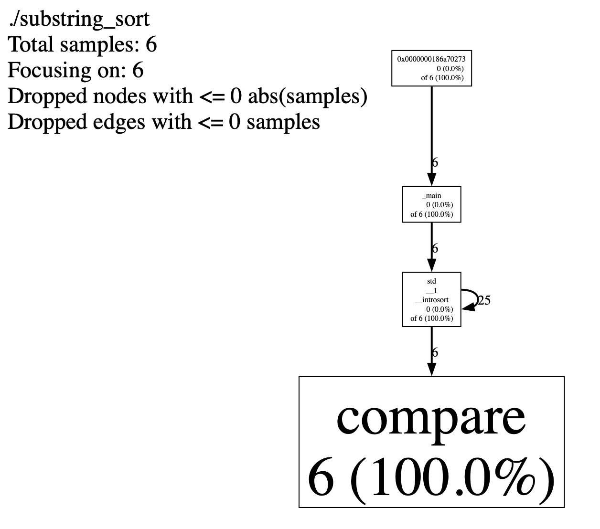

# Tuesday 3-04-2025

## The art of writing efficient programs

### Chapter 2: Performance Measurements
Never guess about performance. Measure.
perf profiler: [link](https://perfwiki.github.io/main/)
Google performance tools: [link](https://github.com/gperftools/gperftools)
Google benchmake library: [link](https://github.com/google/benchmark)
Turns out you can brew install these tools.

```bash
brew install gperftools
brew install google-benchmark
brew install pkg-config
```

Then it's just a matter of a big ugly compiler command. scratch that claude has informed me that the ugly/scary looking cmake command can be swapped out for a cmakelists.txt

```c
cmake_minimum_required(VERSION 3.10)
project(substring_sort)

# Add custom module path - using absolute path
list(APPEND CMAKE_MODULE_PATH ${CMAKE_SOURCE_DIR}/../../cmake)

# Find required packages
find_package(benchmark REQUIRED)
find_package(PkgConfig REQUIRED)
pkg_check_modules(GPERFTOOLS REQUIRED libprofiler)

# Set C++ standard
set(CMAKE_CXX_STANDARD 11)
set(CMAKE_CXX_STANDARD_REQUIRED ON)

# Add library path for gperftools
link_directories(/opt/homebrew/lib)

# Add the substring sort executable
add_executable(substring_sort 
    01_substring_sort.C
    01_substring_sort_a.C
)

target_link_libraries(substring_sort 
    benchmark::benchmark
    profiler
    pthread
    m
)

# Set compile options for the substring_sort target
target_compile_options(substring_sort PRIVATE 
    -O3  # Optimize for maximum speed
    -g   # Generate debug information
)

target_include_directories(substring_sort PRIVATE
    ${CMAKE_CURRENT_SOURCE_DIR}
    ${GBENCH_DIR}/include
    ${GPERFTOOLS_INCLUDE_DIRS}
)

# Add other executables as needed
add_executable(example
    example.C
    compare.C
)

target_compile_options(example PRIVATE 
    -O3
    -g
    -mavx2
    -Wall
    -pedantic
) 
```

then we do the things
```bash
rm -rf build # delete build dir
mkdir build && cd build # make new build dir and cd into it
cmake .. 
make

CPUPROFILE=profile.prof ./substring_sort
pprof --web ./substring_sort profile.prof
# or
pprof --text ./substring_sort profile.prof
```


This is a CPU profile call graph showing where time is spent in your program. Let me break it down:
The numbers show function calls and CPU time:
Total samples: 6 (meaning the profiler took 6 samples)
Each box shows: function_name, samples, % of total time
The call chain goes from top to bottom:
main calls std::__1::introsort
introsort calls compare
The compare function uses 100% (6/6) of the samples, meaning it's your hot spot
Key insights:
The compare function is your performance bottleneck
The self-edge (25) on introsort shows it's recursive/iterative
All CPU time is ultimately spent in string comparisons
To optimize this, you'd want to focus on making the compare function faster since that's where all your time is spent. Let me check what's in that function:

#### CPU time and Wall clock time
CPU time is time that is passing only when the CPU is running
So ex in a user interface program the cpu is idle most of the time waiting for user input and we want CPU time to be as small as possible relative to wall clock time since this signifies efficiency.

If if have this distinction right benchmarking is instrumenting the code inline i.e. run it and see how long it takes, this can also take the form of collecting metrics, e.g. average substring length. 
profiling on the other hand attempts to identify hot spots in the execution

modern profilers use hardware event counters, special registers that can be used to track events. 

Using gperftools since im on mac
```bash 
pprof --text ./substring_sort profile.prof

Total: 7 samples
       6  85.7%  85.7%        6  85.7% compare
       1  14.3% 100.0%        7 100.0% std::__1::__introsort
       0   0.0% 100.0%        7 100.0% 0x0000000186a70273
       0   0.0% 100.0%        7 100.0% _main
```

## Got the ESP running with the thermometer
woohoo
```bash
I (245289) DS18B20App: Stored Temperature: 25.94°C (Index: 4)
I (248039) DS18B20App: Temperature Read: 25.75°C / 78.35°F
I (248039) DS18B20App: Stored Temperature: 25.75°C (Index: 5)
I (250789) DS18B20App: Temperature Read: 25.62°C / 78.12°F
I (250789) DS18B20App: Stored Temperature: 25.62°C (Index: 6)
I (253539) DS18B20App: Temperature Read: 25.50°C / 77.90°F
I (253539) DS18B20App: Stored Temperature: 25.50°C (Index: 7)
I (256289) DS18B20App: Temperature Read: 25.31°C / 77.56°F
I (256289) DS18B20App: Stored Temperature: 25.31°C (Index: 8)
I (259039) DS18B20App: Temperature Read: 25.19°C / 77.34°F
I (259039) DS18B20App: Stored Temperature: 25.19°C (Index: 9)
I (261789) DS18B20App: Temperature Read: 25.06°C / 77.11°F
I (261789) DS18B20App: Stored Temperature: 25.06°C (Index: 0)
```


